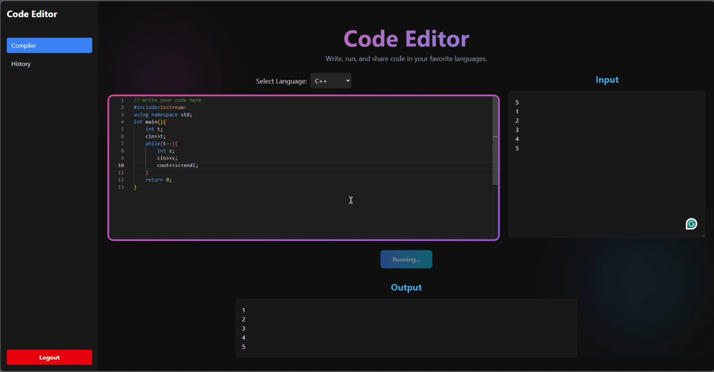
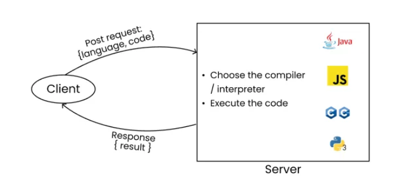
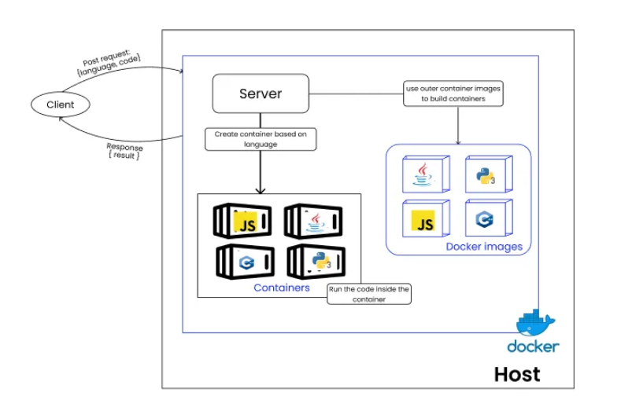

# GoCode  - Secure Online Code Editor & Compiler

## About The Project

This is a service that allows you to execute code snippets in Python, Go, CPP, Java and Javascript through a RESTful API. The service runs Docker containers for executing the provided code safely, ensuring isolation and security.

Watch a demo of the project here:
[](https://drive.google.com/file/d/1KQbCjsPhB1w8ac5-OwrJQ3bbwGNh9QWv/view?usp=sharing)

## Motivation

At some point in our journey as developers, many of us have probably used platforms like LeetCode, Codeforces, or other online coding environments where you simply submit your code, and it magically runs, providing you with instant results. But have you ever stopped to wonder how this process works behind the scenes?

## Features

- **OTP Verification:** Email-based One-Time Password verification for enhanced security.
- **Real-time Code Editor:** Integrated editor for writing and editing code.
- **Multi-language Support:** Compile and execute code in various languages (e.g., Go, C++, Python, etc., depending on configured Docker images).
- **Secure Code Execution:** Isolated execution of user code using Docker containers to prevent malicious attacks and resource exhaustion.
- **Code Saving:** Users can save their code snippets to their profiles.
- **Code History:** View and manage previously saved code.
- **Code Sharing:** Generate shareable links for code snippets with optional expiration.

## Technologies Used

**Backend (Go):**

- **Go:** Primary programming language
- **Gin Web Framework:** For building RESTful APIs
- **MongoDB:** Primary database for user data, code snippets, and shared links
- **Redis:** For caching and potentially session management
- **Docker:** For sandboxed code execution
- **JWT:** For authentication
- **CORS:** For handling cross-origin requests

**Frontend (React):**

- **React.js:** JavaScript library for building user interfaces
- **Tailwind CSS:** For structuring and styling
- **Axios:** For making HTTP requests to the backend
- **React Router:** For client-side routing

## Architecture Overview

The project follows a client-server architecture

- **Frontend:** A React application provides the user interface, handling code editing, user authentication, and displaying execution results.
- **Backend:** A Go application serves the API endpoints. It manages user data, code storage, and orchestrates the code compilation and execution process.
  

- **Code Execution Sandbox:** The backend utilizes Docker to create isolated environments (Docker-in-Docker) for compiling and running user-submitted code. Each execution request spins up a new, ephemeral Docker container based on pre-configured language-specific images. This ensures security and prevents code from affecting the main server or other users.
  


- **Databases:** MongoDB is used for persistent data storage, while Redis is integrated for caching purposes.

## Getting Started

To get a local copy up and running, follow these simple steps.

### Prerequisites

Make sure you have the following installed on your machine:

- **Go:** [Download & Install Go](https://golang.org/doc/install) (version 1.24 or higher recommended)
- **Node.js & npm:** [Download & Install Node.js](https://nodejs.org/en/download/) (which includes npm)
- **Docker Desktop:** [Download & Install Docker Desktop](https://www.docker.com/products/docker-desktop)
- **MongoDB:** [Install MongoDB Community Edition](https://docs.mongodb.com/manual/installation/) (or use a cloud-hosted solution like MongoDB Atlas)
- **Redis:** [Install Redis](https://redis.io/docs/getting-started/installation/) (or use a cloud-hosted solution)

### Cloning the Repository

```bash
git clone https://github.com/RaM21234/golang_code_compiler_engine.git
cd download_folder
```

### Environment Variables

Create a `.env` file in the `backend/` directory with the following variables:

```
MONGO_URI: Your MongoDB connection string
JWT_SECRET:A strong, random secret key for JWT
MAIL_HOST: Your SMTP host (e.g., smtp.gmail.com)
MAIL_ID: Your email for sending OTPs
MAIL_PASSWORD: Your email password
```

**Note:** For `MAIL_PASSWORD`, if you are using Gmail, you might need to generate an App Password instead of using your regular password, especially if you have 2-Factor Authentication enabled.

###  Setup

1.  Navigate to the `main folder` directory and execute these commands:
    ```bash
    docker-compose up
    ```
    
## References

- https://medium.com/@blogs4devs/implementing-a-remote-code-execution-engine-from-scratch-4a765a3c7303
- https://medium.com/@lijuthomasliju03/building-a-sandboxed-code-execution-engine-using-golang-and-docker-220fd4a081c8

## Contact

Ram Kumar Verma - ramkumaravs01@gmail.com
